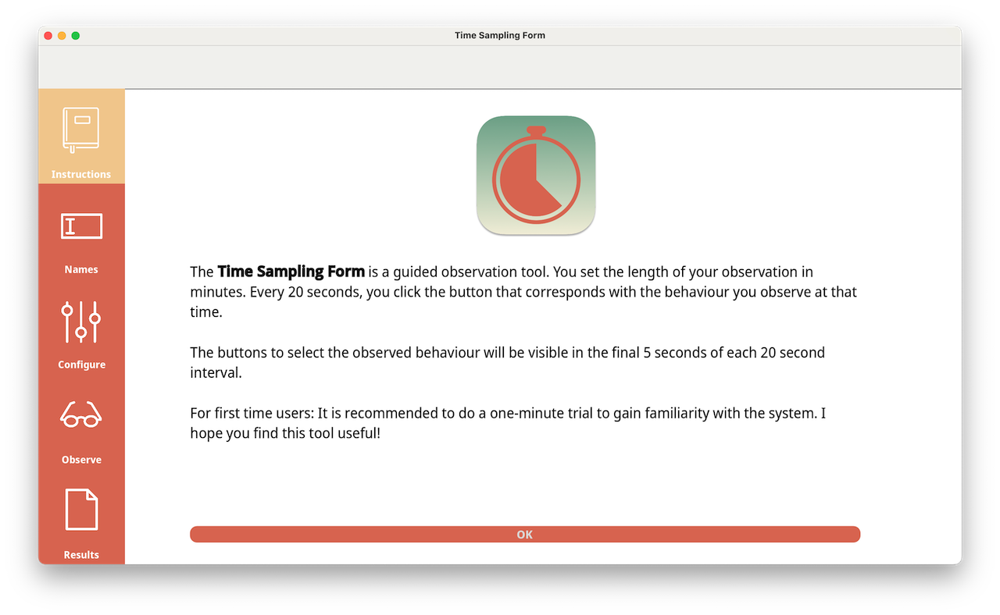

<h1 align="center">Time Sampling Form</h1>

<strong>Built with Godot</strong>

A freeware and open source education-related observation tool. The <a href="https://www.jaapmarsman.com/tsf_web/" target="_blank">web version is available here</a> (now works on iPads too).

## Manual

For a detailed manual on how to use the Time Sampling Form, please go to <a href="https://docs.jaapmarsman.com/time-sampling-form.html" target="_blank">this page</a>.

## License & Attributions

Licensed under the [AGPL-3.0](LICENSE.md)

Copyright (c) 2022-present, [Jaap Marsman](https://www.jaapmarsman.com/)

For an overview of all underlying attributions, please see the [Copyright document](COPYRIGHT.md).
