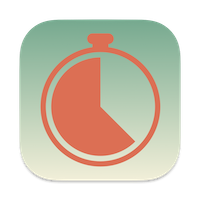

# Time Sampling Form

A freeware and open source SEN-related observation tool.

## To be written up...

The rest of this Readme will be written.

## License & Attributions

 This work is licensed under a <a rel="license" href="http://creativecommons.org/licenses/by-nc-nd/4.0/" target="_blank">Creative Commons Attribution-NonCommercial-NoDerivatives 4.0 International License</a>.

For an overview of all underlying licences, copyrights and attributions, please see the [Copyrights document](COPYRIGHTS.md).